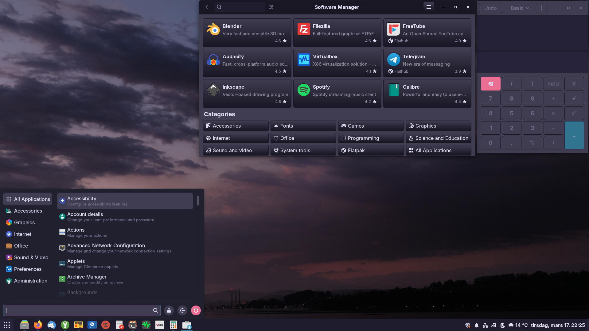

<p align="center">
  
</p>
<h1 align="center">Adwaita Rosé Pine</h1>
<p align="center">
A complete Rosé Pine recolor of the classic Adwaita Dark GTK theme.
</p>
<p align="center">


</p>

---

## Preview



---

## Color Palette

| Element | Color |
|--------|------|
| Background | `#191724` |
| Surface | `#1f1d2e` |
| Overlay | `#26233a` |
| Muted | `#6e6a86` |
| Subtle | `#908caa` |
| Text | `#e0def4` |
| Love (Red) | `#eb6f92` |
| Gold (Yellow) | `#f6c177` |
| Rose (Pink) | `#ebbcba` |
| Pine (Green) | `#31748f` |
| Foam (Cyan) | `#9ccfd8` |
| Iris (Purple) | `#c4a7e7` |
| Highlight Low | `#21202e` |
| Highlight Med | `#403d52` |
| Highlight High | `#524f67` |

---

## Coverage

| Layer | Status |
|------|-------|
| GTK2 | ✓ Legacy app support |
| GTK3 | ✓ Full, all widget states |
| GTK4 / libadwaita | ✓ See setup below |
| Cinnamon 6.x shell | ✓ Panel, menus, OSD, dialogs, notifications |
| Gnome Shell | ✓ Top bar, overview, notifications, quick settings, calendar |

---

# Installation

Clone the repository:

```bash
mkdir -p ~/.themes
git clone https://github.com/librerob/Adwaita-Rose-Pine \
~/.themes/Adwaita-Rose-Pine
# or
git clone https://codeberg.org/librerob/Adwaita-Rose-Pine \
~/.themes/Adwaita-Rose-Pine
```

Or download the archive and extract it to:

```
~/.themes
```

Open **System Settings → Themes** and set:

```
Applications
Desktop
```

to:

```
Adwaita-Rose-Pine
```

OR

**Activate Theme (Terminal)**

Set the theme using gsettings:

```bash
gsettings set org.cinnamon.desktop.interface gtk-theme 'Adwaita-Rose-Pine'
gsettings set org.cinnamon.desktop.wm.preferences theme 'Adwaita-Rose-Pine'
gsettings set org.cinnamon.theme name 'Adwaita-Rose-Pine'
```

To reload the Cinnamon shell without logging out:

```
Alt + F2
r
Enter
```

---

# Libadwaita Setup

Libadwaita applications do **not read themes from `~/.themes`**.
They instead read configuration from:

```
~/.config/gtk-4.0
```

Copy the theme files:

```bash
mkdir -p ~/.config/gtk-4.0
cp -r ~/.themes/Adwaita-Rose-Pine/gtk-4.0/assets \
~/.config/gtk-4.0/
cp ~/.themes/Adwaita-Rose-Pine/gtk-4.0/gtk.css \
~/.config/gtk-4.0/
cp ~/.themes/Adwaita-Rose-Pine/gtk-4.0/gtk-dark.css \
~/.config/gtk-4.0/
```

Restart affected applications or log out and back in.

---

# Flatpak Configuration

Allow Flatpak applications to access installed themes:

```bash
flatpak override --user \
--filesystem=xdg-config/gtk-4.0 \
--filesystem=home/.themes/
```

For programs run as **root**, create a symlink so the theme is visible system wide:

```bash
sudo ln -s ~/.themes/Adwaita-Rose-Pine /usr/share/themes/
```

---

# Credits

**Adwaita**  
Original theme by the GNOME project.

**Rosé Pine**  
Color scheme by https://rosepinetheme.com

---

# License

This project is licensed under the LGPL-2.1 license.
You are free to use, modify, and redistribute this theme under the terms of the GNU Lesser General Public License version 2.1.

See the LICENSE file in this repository for the full license text.
